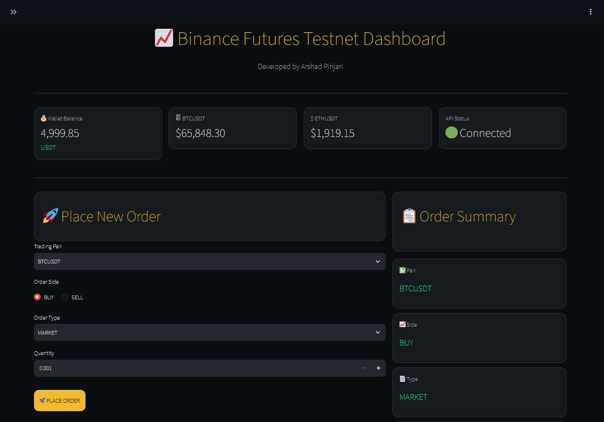
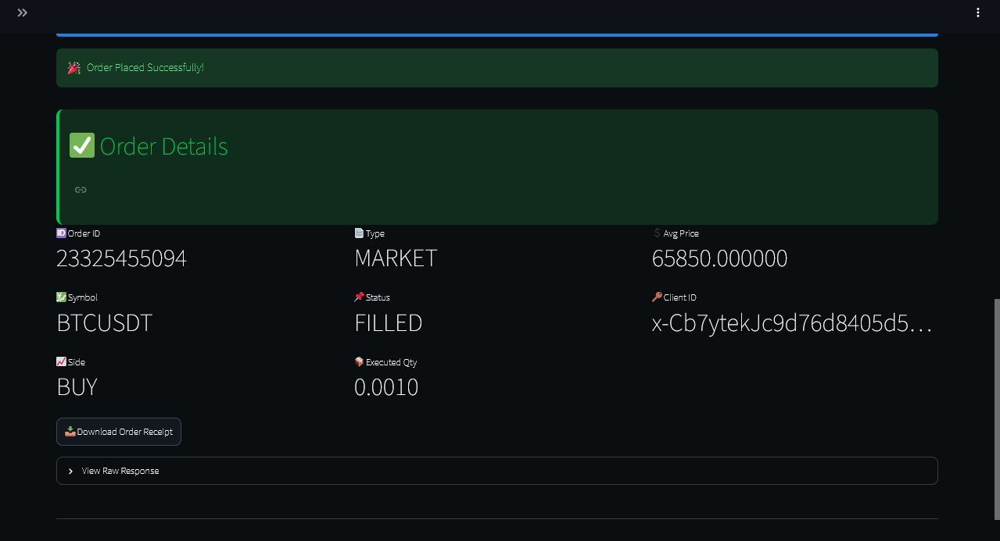

# 🚀 Binance Futures Testnet Trading Bot

A Python-based trading bot that interacts with the **Binance Futures Testnet API** through an interactive **Streamlit Dashboard**. The application allows users to place **MARKET** and **LIMIT** orders, monitor wallet balance, and view live cryptocurrency prices in real time.

---

## ✨ Features

- 🔐 Binance Futures Testnet API Integration
- 📈 Live BTCUSDT & ETHUSDT Prices
- 💰 Futures Wallet Balance
- 🟢 Place MARKET Orders
- 🔵 Place LIMIT Orders
- 📋 Order Summary
- 📦 Order Execution Details
- ⬇️ Download Order Response (JSON)
- ✅ Input Validation
- ⚠️ Error Handling
- 📝 Logging Support
- 💻 Command Line Interface (CLI)
- 🎨 Modern Streamlit Dashboard

---

## 🛠️ Tech Stack

- Python
- Streamlit
- python-binance
- Binance Futures Testnet API
- python-dotenv

---

## 📂 Project Structure

```
trading-bot-binance-testnet/
│
├── app.py
├── requirements.txt
├── README.md
├── .gitignore
│
├── screenshots/
│   ├── dashboard.png
│   ├── order-success.png
│   └── github-repository.png
│
└── bot/
    ├── __init__.py
    ├── client.py
    ├── orders.py
    ├── validators.py
    ├── logging_config.py
    └── cli.py
```

---


## 📸 Screenshots

### 🖥️ Dashboard



---

### ✅ Successful Order



---

## ⚙️ Installation

### Clone Repository

```bash
git clone https://github.com/tejaswinipawarofficial/binance-testnet.git
cd trading-bot-binance-testnet
```

### Install Dependencies

```bash
pip install -r requirements.txt
```

### Configure Environment Variables

Create a `.env` file in the project root.

```env
BINANCE_API_KEY=your_testnet_api_key
BINANCE_API_SECRET=your_testnet_api_secret
```

> **Note:** Use Binance Futures **Testnet** API credentials only.

---

## ▶️ Run the Application

```bash
streamlit run app.py
```

Open in your browser:

```
http://localhost:8501
```

---

## 💡 Dashboard Features

- Wallet Balance
- Live BTCUSDT Price
- Live ETHUSDT Price
- API Connection Status
- MARKET Order Placement
- LIMIT Order Placement
- Order Summary
- Order Execution Details
- Download Order Response

---

## 💻 Command Line Interface

Run the CLI version:

```bash
python -m bot.cli
```

---

## 📌 Sample Order

| Field | Value |
|-------|-------|
| Symbol | BTCUSDT |
| Side | BUY |
| Type | MARKET |
| Quantity | 0.001 |

---

## 🔒 Security

- API credentials stored using `.env`
- `.env` excluded using `.gitignore`
- No API keys are committed to the repository

---

## 🚀 Future Enhancements

- Open Orders
- Cancel Orders
- Order History
- Trade History
- Portfolio Analytics
- Multi-Symbol Support
- Real-Time Charts

---

## 👨‍💻 Author

**Tejaswini Pawar**

- GitHub: https://github.com/tejaswinipawarofficial

---

